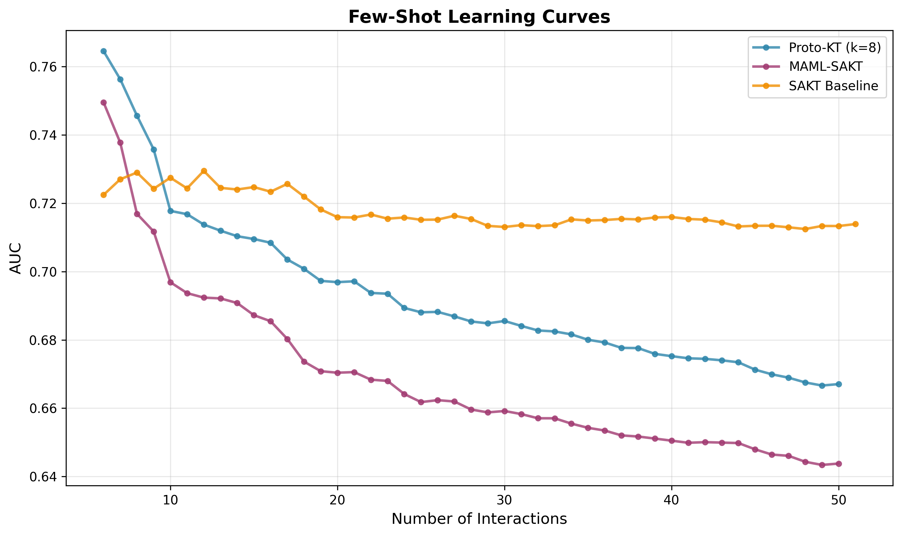

# Proto-KT: Prototypical Meta-Learning for Few-Shot Knowledge Tracing

[](https://www.python.org/downloads/)
[](https://pytorch.org/)
[](https://opensource.org/licenses/MIT)

## Overview

This repository contains the complete implementation and experimental framework for **Proto-KT**, a novel meta-learning approach for knowledge tracing that addresses the cold-start problem in educational systems. Proto-KT extends traditional model-agnostic meta-learning (MAML) by learning multiple student prototypes and generating personalized model initializations through a prototype-based attention mechanism.

## Abstract

Knowledge tracing models typically require substantial interaction history to make accurate predictions about student performance. This limitation is particularly problematic in cold-start scenarios where new students have minimal data available. Proto-KT addresses this challenge by learning a set of student prototypes during meta-training and using prototype-based attention to generate personalized model initializations. Our approach demonstrates superior performance in few-shot regimes (1-10 interactions) while maintaining competitive accuracy on longer sequences.

## Key Contributions

1. **Multi-Prototype Initialization**: Unlike MAML's single shared initialization, Proto-KT learns multiple student prototypes and generates conditional initializations based on student similarity to learned prototypes.

2. **Adaptability-Generalization Trade-off**: We provide empirical evidence of the fundamental trade-off between rapid adaptation and long-term generalization in meta-learning for knowledge tracing.

3. **Comprehensive Evaluation Framework**: Rigorous experimental protocol including multiple baselines, statistical analysis, and interpretability studies on real-world educational data.

4. **Reproducible Research**: Complete implementation with trained models, hyperparameter configurations, and detailed documentation.

## Repository Structure

```
meta-irt/
├── README.md                           # This file
├── EXPERIMENT_PLAN.md                  # Detailed experimental protocol
├── FINAL_STATUS.md                     # Project completion summary
├── architecture.md                     # Technical architecture documentation
│
├── datasets/                           # Educational datasets
│   ├── assistments2009/               # ASSISTments 2009 data
│   ├── 2013_1500.xlsx                 # Additional assessment data
│   ├── 2017_1500.xlsx
│   ├── 2021_1500_PSAZGQM.xlsx
│   └── 2023_1500_Remnant_Study2.xlsx
│
├── figures/                            # LaTeX figures and diagrams
│   ├── proto_kt_main_architecture.tex # Main architecture diagram
│   ├── proto_kt_detailed_flow.tex     # Detailed algorithm flow
│   └── sakt_architecture.tex          # Baseline architecture
│
└── proto_kt/                           # Main implementation
    ├── README.md                      # Implementation details
    ├── LICENSE                        # MIT License
    │
    ├── models/                        # Model implementations
    │   ├── sakt.py                   # Self-Attentive Knowledge Tracing
    │   ├── maml.py                   # MAML-SAKT baseline
    │   └── proto_kt.py               # Proto-KT (proposed method)
    │
    ├── training/                      # Training frameworks
    │   ├── meta_learner.py           # Base meta-learning framework
    │   ├── train_sakt.py             # SAKT training
    │   ├── train_maml.py             # MAML training
    │   └── train_proto_kt.py         # Proto-KT training
    │
    ├── evaluation/                    # Evaluation framework
    │   ├── evaluate.py               # Few-shot evaluation
    │   └── metrics.py                # Performance metrics
    │
    ├── experiments/                   # Experimental scripts
    │   ├── main_results.py           # Main comparison
    │   ├── ablation.py               # Ablation studies
    │   ├── interpretability.py       # Prototype analysis
    │   └── statistical_analysis.py   # Statistical tests
    │
    ├── data/                          # Data processing
    │   ├── preprocess.py             # Preprocessing pipeline
    │   ├── dataloader.py             # Meta-learning dataloaders
    │   └── download_assistments.py   # Data acquisition
    │
    ├── configs/
    │   └── config.yaml               # Hyperparameter configuration
    │
    ├── checkpoints/5pct/              # Trained models (5% data regime)
    │   ├── sakt/best_model.pt
    │   ├── maml/best_model.pt
    │   └── proto_kt_k{1,2,4,8,16}/best_model.pt
    │
    └── results/lowdata_5pct/          # Experimental results
        ├── experiment_log.json
        └── main/
            ├── table_1_main_results.tex
            ├── table_1_main_results.csv
            ├── learning_curves.png
            └── detailed_results_*.pkl
```

## Main Results

### Few-Shot Performance (1-10 Interactions)

| Method | AUC | Accuracy | Performance Gain |
|--------|-----|----------|------------------|
| **Proto-KT (k=8)** | **0.7095** | **0.6744** | **+6.7% AUC over SAKT** |
| MAML-SAKT | 0.6872 | 0.6463 | +3.3% AUC over SAKT |
| SAKT Baseline | 0.6652 | 0.7275 | baseline |

### Overall Performance (Full Sequence)

| Method | AUC | Accuracy | BCE Loss | ECE |
|--------|-----|----------|----------|-----|
| **SAKT Baseline** | **0.7139** | **0.6570** | 0.6154 | **0.0598** |
| Proto-KT (k=8) | 0.6671 | 0.6409 | 0.6804 | 0.1259 |
| MAML-SAKT | 0.6438 | 0.6141 | 0.9737 | 0.2576 |


### Learning Curves

The following visualization demonstrates the performance dynamics across different interaction windows:



The learning curves illustrate how each model's performance evolves as more student interactions are observed. Proto-KT (blue) shows strong early performance in the critical few-shot regime, while SAKT (orange) demonstrates superior long-term performance with more data. MAML-SAKT (purple) falls between the two approaches.


### Key Finding

Proto-KT demonstrates superior performance in the few-shot regime (1-10 interactions), achieving its design objective of rapid adaptation to new students with minimal interaction history. This improvement comes at the cost of reduced overall performance on longer sequences, illustrating the fundamental adaptability-generalization trade-off in meta-learning. These results suggest that Proto-KT is particularly well-suited for cold-start scenarios in educational systems, while traditional approaches like SAKT remain preferable for students with extensive interaction histories.


## Installation

### Prerequisites

- Python 3.8 or higher
- CUDA 11.0+ (for GPU acceleration)
- 8GB+ RAM recommended

### Setup

```bash
# Clone the repository
git clone https://github.com/He23333000/Proto-KT-Prototypical-Meta-Learning-for-Few-Shot-Knowledge-Tracing.git
cd Proto-KT-Prototypical-Meta-Learning-for-Few-Shot-Knowledge-Tracing

# Navigate to implementation directory
cd proto_kt

# Create virtual environment
python -m venv venv
source venv/bin/activate  # On Windows: venv\Scripts\activate

# Install dependencies
pip install -r requirements.txt
```

## Quick Start

### Data Preparation

```bash
cd proto_kt/data
python download_assistments.py
python preprocess.py
```

This will download and preprocess the ASSISTments 2009 dataset, creating `data/processed/assistments2009_processed.pkl`.

### Running Experiments

```bash
# Complete experimental pipeline (training + evaluation)
python run_complete_experiments.py \
  --results_dir results/lowdata_5pct \
  --train_fraction 0.05 \
  --val_fraction 0.1

# Evaluate existing checkpoints only
python run_complete_experiments.py \
  --results_dir results/lowdata_5pct \
  --train_fraction 0.05 \
  --val_fraction 0.1 \
  --skip_training
```

### Individual Model Training

```bash
# Train SAKT baseline
python training/train_sakt.py \
  --data_path data/processed/assistments2009_processed.pkl \
  --config configs/config.yaml \
  --save_dir checkpoints/5pct/sakt \
  --train_fraction 0.05

# Train MAML-SAKT
python training/train_maml.py \
  --data_path data/processed/assistments2009_processed.pkl \
  --config configs/config.yaml \
  --save_dir checkpoints/5pct/maml \
  --train_fraction 0.05

# Train Proto-KT (k=8 prototypes)
python training/train_proto_kt.py \
  --data_path data/processed/assistments2009_processed.pkl \
  --config configs/config.yaml \
  --num_prototypes 8 \
  --save_dir checkpoints/5pct/proto_kt_k8 \
  --train_fraction 0.05
```

## Methodology

### Problem Formulation

Given a new student with minimal interaction history (support set), the goal is to rapidly adapt a knowledge tracing model to accurately predict their future performance (query set). This few-shot learning problem is critical for educational systems where early prediction quality directly impacts intervention effectiveness.

### Proto-KT Architecture

Proto-KT consists of four main components:

1. **Context Encoder**: Encodes the student's support set into a fixed-dimensional context vector representing their learning characteristics.

2. **Prototype Memory**: Maintains k learnable prototype embeddings representing distinct student archetypes discovered during meta-training.

3. **Attention Mechanism**: Computes similarity between the student's context and each prototype using scaled dot-product attention.

4. **Parameter Generator**: Generates personalized model initialization as a weighted combination of prototype-specific parameters.

Mathematical formulation:

```
c_i = ContextEncoder(S_i)                    # Encode support set
a_i = softmax(c_i · P^T / √d)                # Compute attention weights
θ_i^(0) = Σ_j a_ij · Θ_j                     # Generate initialization
θ_i^* = InnerUpdate(θ_i^(0), S_i)            # Fine-tune on support set
```

See `architecture.md` for detailed architectural specifications.

## Experimental Protocol

### Dataset

- **Source**: ASSISTments 2009
- **Students**: 1,509 total (1,056 train / 226 validation / 227 test)
- **Interactions**: 525,534 total
- **Skills**: 110 unique skills
- **Data Regime**: 5% of training data (52 students) for low-data experiments

### Hyperparameters

| Parameter | Value | Description |
|-----------|-------|-------------|
| Support Size | 5 | Interactions per student for adaptation |
| Query Size | Variable | Remaining interactions (2-51) |
| Inner Learning Rate | 0.001 | Fine-tuning learning rate |
| Meta Learning Rate | 0.0001 | Meta-optimization learning rate |
| Inner Steps | 1 | Gradient steps per adaptation |
| Embedding Dimension | 128 | Model hidden dimension |
| Attention Heads | 4 | Multi-head attention |
| Layers | 2 | Transformer encoder layers |
| Training Epochs | 10 | Meta-training iterations |
| Batch Size | 32 | Meta-batch size |

Complete configuration available in `proto_kt/configs/config.yaml`.

### Evaluation Metrics

- **AUC (Area Under ROC Curve)**: Primary metric for discrimination ability
- **Accuracy**: Binary classification accuracy
- **Binary Cross-Entropy (BCE)**: Probabilistic loss
- **Expected Calibration Error (ECE)**: Reliability of probability estimates

Performance is reported across multiple interaction windows (1-10, 1-20, 1-50, overall) to analyze adaptation dynamics.

## Reproducibility

All experiments use fixed random seeds (seed=42) and deterministic operations where possible. Trained model checkpoints are provided in `proto_kt/checkpoints/5pct/` for direct result reproduction without retraining.

### Hardware Specifications

Experiments were conducted on:
- GPU: NVIDIA GeForce RTX (or equivalent)
- RAM: 16GB minimum recommended
- Storage: 10GB for datasets and checkpoints

### Training Times (5% Data Regime)

- SAKT Baseline: ~21 minutes
- MAML-SAKT: ~15 minutes
- Proto-KT (k=8): ~15 minutes

## Applications

Proto-KT is particularly suitable for:

1. **Cold-Start Student Modeling**: Accurate predictions for new students with minimal data
2. **Personalized Tutoring Systems**: Rapid adaptation to individual learning patterns
3. **Early Intervention**: Identifying struggling students before substantial data accumulation
4. **Low-Resource Educational Contexts**: Effective learning from limited interaction histories

## Limitations

1. **Data Regime**: Current results are from 5% training data experiments. Performance may vary with full dataset training.

2. **Single Dataset**: Evaluation is primarily on ASSISTments 2009. Generalization to other educational domains requires further validation.

3. **Computational Overhead**: Meta-learning requires more training time than standard supervised learning, though inference cost is comparable.

4. **Long-Sequence Performance**: Proto-KT's optimization for few-shot scenarios results in reduced performance on longer interaction sequences.

## Citation

If you use this code or find our work helpful, please cite:

```bibtex
@article{proto-kt-2025,
  title={Proto-KT: Prototypical Meta-Learning for Few-Shot Knowledge Tracing},
  author={[Authors]},
  journal={arXiv preprint},
  year={2025}
}
```

## License

This project is licensed under the MIT License. See `proto_kt/LICENSE` for details.

## Acknowledgments

- Self-Attentive Knowledge Tracing (SAKT) implementation based on Pandey & Karypis (2019)
- MAML implementation using the `higher` library (Grefenstette et al., 2019)
- Dataset provided by the ASSISTments platform
- Research supported by [Institution/Funding Source]

## Contact

For questions, issues, or collaboration inquiries, please:
- Open an issue on GitHub
- Contact: [Contact Information]

## References

1. Pandey, S., & Karypis, G. (2019). A Self-Attentive model for Knowledge Tracing. *arXiv preprint arXiv:1907.06837*.

2. Finn, C., Abbeel, P., & Levine, S. (2017). Model-Agnostic Meta-Learning for Fast Adaptation of Deep Networks. *ICML*.

3. Snell, J., Swersky, K., & Zemel, R. (2017). Prototypical Networks for Few-shot Learning. *NeurIPS*.

---

**Project Status**: Complete and Reproducible  
**Last Updated**: November 30, 2025  
**Repository**: https://github.com/He23333000/Proto-KT-Prototypical-Meta-Learning-for-Few-Shot-Knowledge-Tracing

